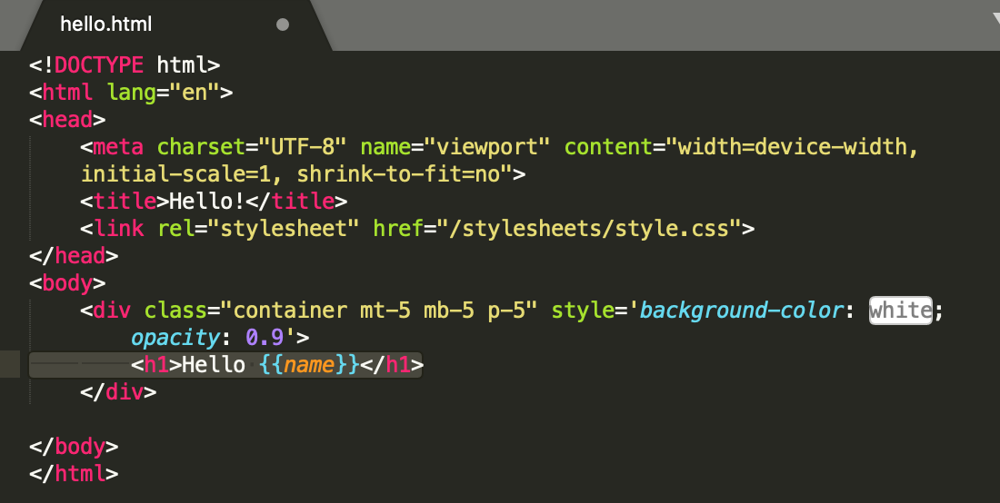

# Read: 03 - Flexbox and Templating

## [Javascript Templating Language Engine - Mustache.js with Node and Express](https://medium.com/@1sherlynn/javascript-templating-language-and-engine-mustache-js-with-node-and-express-f4c2530e73b2)

**JS Templating**

Javascript templating is a fast and efficient technique to render client-side view templates with JavaScript by using a JSON data source. The template is HTML markup, with added templating tags that will either insert variables or run programming logic. 

**Mustache**

Mustache is a logic-less template syntax. It can be used for HTML, config files, source code - anything. It works by expanding tags in a template using values provided in a has or object.
- It's referred to "logic-less" because there are no if statements, else clauses, or for loops. 
- Instead there are only tags. Some tags are replaced with a value, some nothing, and others a series of values. 

mustache.js is an implementation of the mustache template system in JS. It is often considered the base for JS templating. 
However, mustache itself appears to not be a templating engine after all, rather, it is a **specification** for a templating language. 
In general, we would write templates according to the mustache spec, and it can then be compiled by a templating engine to be rendered to create an output.

**Mustache Express**

If you intednt to use mustache with Node and Express, you can use mustache-express, which lets you use them together easily.

To install with NPM:
$ npm install mustache --save
Configure mustache-express in your server.js/app.js/index.js file:

Create a views folder and add some html view templates:

Then in router configuration, use res.render(TEMPLATE_NAME, JSON_DATA):
res.render('hello', {"name": "Sherlynn"})

The first parameter 'hello' refers to hello.html file. The second param would be the JSON data itself. We can also pass in a variable representing the data, for example:
var nameObject = {"name": "Sherlynn"}
res.render('hello', nameObject)

- [Minimal Templating with mustache in JavaScript](https://github.com/janl/mustache.js)

- [A Complete Guide to Flexbox](https://css-tricks.com/snippets/css/a-guide-to-flexbox/)

This link is a good resource for when you are using flexbox. There's a lot of material in there which is why you didn't take notes here. 

- [Flexbox Froggy Game](https://flexboxfroggy.com/)

This game helps you learn flexbox.

[Table of Contents](README.md)