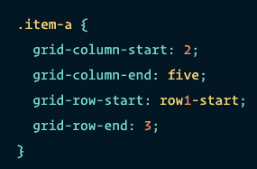
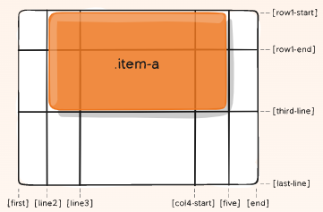
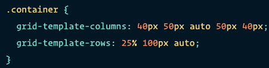
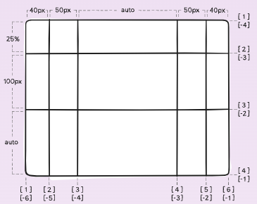

# Read: 04 - CSS Grid

## [Grid Columns, Rows, Templating:](https://css-tricks.com/snippets/css/complete-guide-grid/)

See also: [Responsive Layouts with CSS Grid](https://medium.com/samsung-internet-dev/common-responsive-layouts-with-css-grid-and-some-without-245a862f48df)

**grid-column-start, grid-column-end, grid-row-start, grid-row-end** Are properties that determine a grid item's location within the grid by referring to specific grid lines. 
- grid-column-start/grid-row-start is the line where the item begins.
- grid-column-end/grid-row-end is the line where the item ends.

**Values**

- ```<line>``` - can be a number to refer to a numbered grid line, or a name to refer to a named grid line.
- span ```<number>``` - the item will span accross the provided number of grid tracks. 
- span ```<name>``` - the item will span accross until it hits the next line with the provided name.
- auto - indicates auto-placement, an automatic span, or a default span of one.

**Example**


**grid-template-columns, grid-template-rows** 

Define the columns and rows of the grid with a space-seperated list of values. The values represent the track size, andn the space between them represents the grid line.

**Values**

- ```<track-size>``` - can be a length, a percentage, or a fraction of the free space in the grid (using the **fr** unit)
- ```<line-name>``` - an arbitrary name of your choosing

**Example**


- For more detail see link on header.

### [RegExr](https://regexr.com/)

- [Tutorial](https://medium.com/factory-mind/regex-tutorial-a-simple-cheatsheet-by-examples-649dc1c3f285)

Cheatsheet:


[Table of Contents](README.md)