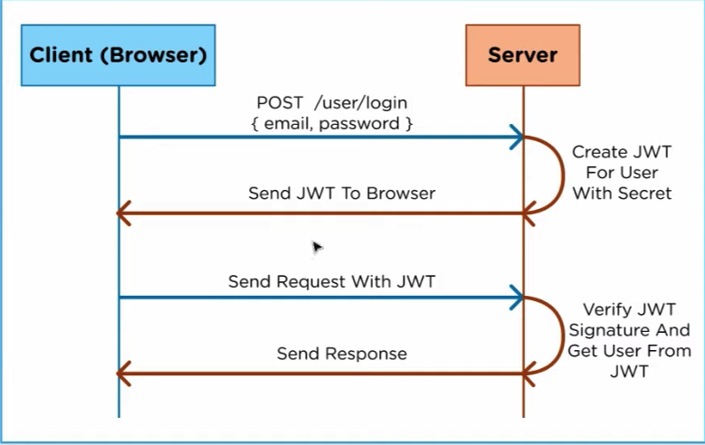

# Bearer Authorization

1. Write the following steps in the correct order:

- Register your application to get a client_id and client_secret
- Receive authorization code
- Ask the client if they want to sign in via a third party
- Make a request to a third-party API endpoint
- Receive access token
- Make a request to the access token endpoint
- Redirect to a third party authentication endpoint

1. What can you do with an authorization code?

- An authorization code gives you the ability to send back to the authorization server to give the client back an access token

1. What can you do with an access token?

- An access token gives authorization to provide data it is requesting but is limited to getting only that data

1. What’s a benefit of using OAuth instead of your own basic authentication?

- Security. OAuth utilizes authorization and access tokens which has added layers of security. Also JWT verifies signature when the client is requesting data. Meaning the client can't change the access token.

## Vocab

- _Client ID_
  - a public identifier for apps. Even though it's public, it's best that is isn't guessable by third parties. It must also be unique across all clients that the authorization server handles.
- _Client Secret_
  - a secret known only to the app and authorization server. It must be sufficiently random to not be guessable, which means you should avoid using common UUID libraries which often take into account the timestamp or MAC address of the server generating it. A good way to generate a secure secret is to use a cryptographically-secure library to generate a 256-bit value and converting it to a hexadecimal representation.
- _Authentication Endpoint_
  - a security mechanism designed to ensure that only authorized devices can connect to a given network, site or service.
- _Access Token Endpoint_
  - token endpoints are where apps make a request to get an access token for a user.
- _API Endpoint_
  - is the point of entry in a communication channel when two systems are interacting. It refers to touchpoints of the communication between an API and a server. The endpoint can be viewed as the means from which the API can access the resources they need from a server to perform their task. Basically a fancy word for a URL of a server or service
- _Authorization Code_
  - is an alphanumeric password that authrozied its user to purchase, sell or transfer items, or to enter information into a security-protected space. Typically a sequence of letters, numbers, or a combination of both, that validates a person's identity, approves a transaction or provides access to a secured area.
- _Access Token_
  - are the thing that app's use to make API requests on behalf of a user. Access tokens represent the authorization of a specific application to access specific parts of a user's data.

### [JWT Explained](https://www.youtube.com/watch?v=926mknSW9Lo)

- What is JSON Web Token?
  - Open standard
  - Securely transfer information between any two bodies.
  - Digitally Signed - information is verified and trusted.
  - Compact
    - JWT can be sent via URL, POST request, HTTP Header
    - Fast Transmission
  - Self-contained
    - Contains information about the user
    - Avoids querying the database more than once.
- JWT Uses
  - Authentication
  - Information Exchange
- JWT structure
  - Header
    - JSON object
      - Algorithm
      - Type of JWT token
      - These are then encoded by **base64** and forms the first part
  - Payload
    - It contains claims
    - Claims are user details or additional or additional metadata.
    - Payload is then **base64** encoded to form the second part
  - Signature
    - combines base64 header and payload with secret.
    - provides more security
  - Combine all to form JWT
- How do JWT tokens work?

  1. Browser sends Post request to login with credentials to server
  2. Server generates JWT via Secret
  3. Server returns the JWT to the browser
  4. Browser sends the JWT on the authorization header
  5. Server checks JWT signature and gets user info
  6. Browser sends response to the client
     

- If client changes access tokens at all it will be an invalid

### [Intro to JWT](https://jwt.io/introduction/)

### [Are JWTs Secure?](https://stackoverflow.com/questions/27301557/if-you-can-decode-jwt-how-are-they-secure)

[Table of Contents](../README.md)
