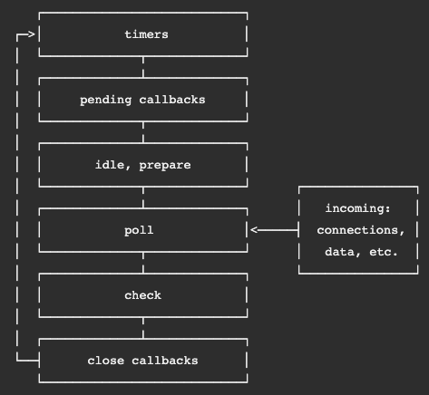

# TCP Servers

1. Given the examples of front-end events such as button click, window resize, form submit, etc, what are some examples of back-end events?

- You can use [net module](https://nodejs.org/api/net.html), which is a node module that provides async network API for creating stream-based TCP. TCP and OSI models are what creates a connection from application to server. See [Build a TCP Server](https://techbrij.com/node-js-tcp-server-client-promisify) and [Applications with Server-Sent Events](https://auth0.com/blog/developing-real-time-web-applications-with-server-sent-events/)
  and refer to **Building Real-Time Backends with SSE's**

2. Why are events sometimes better than asynchronous actions with callbacks?

- Because you are declaring exactly which methods you want to be asynchronous by using setImmediate() or process.nextTick.

3. What does an EventEmitter instance do?

- EventEmitter is a class that emits an event function (eventEmitter.on()). When EE emits an event, all of the functions attached to that specific event are called _synchronously_. Any values returned by the called listeners are ignored or discarded.

4. When is a program’s call stack, event queue, and event loop active?

### Vocab

- [OSI Model](https://www.cloudflare.com/learning/ddos/glossary/open-systems-interconnection-model-osi/)
  - Open Systems Interconnection model is a coneptual model created by the International Organization for Standardization which enables diverse communication systems to communicate using standard protocols. English - OSI provides a standard for different computer systems to be able to communicate with each other.
- [_TCP_](https://searchnetworking.techtarget.com/definition/TCP)
  - Transmission Control Protocol is a standard that defines how to establish and maintain a network conversation through which application programs can exchange data. TCP is a connection-oriented protocol, which means a connection is established and maintained until the application programs at each end have finished exchanging messages
    - TCP is used in conjunction with IP (internet protocol) in order to maintain a connection between the sender and the target and to ensure packet order
- [_Observer Pattern_](https://en.wikipedia.org/wiki/Observer_pattern)
  - is a software design pattern in which an object, called the **subject**, maintains a list of its dependents, called observers, and notifies them automatically if any state changes, usually by calling one of their methods.
- [_Listener_](https://www.geeksforgeeks.org/javascript-addeventlistener-with-examples/#:~:text=An%20event%20listener%20is%20a,a%20key%20on%20the%20keyboard.)
  - An event listener is a procedure in JavaScript that waits for an event to occur. The simple example of an event is a user clicking the mouse or pressing a key on the keyboard.
- [_Event Handler_](https://developer.mozilla.org/en-US/docs/Web/Guide/Events/Event_handlers)
  - are properties on certain DOM elements to manage how that element reacts to events.
- [_Event Driven Programming_](https://en.wikipedia.org/wiki/Event-driven_programming)
  - event-driven programming is a programming paradigm in which the flow of the program is determined by events such as user actions (mouse clicks, key presses), sensor outputs, or messages from other programs or threads. Event-driven programming is the dominant paradigm used in graphical user interfaces and other applications (e.g., JavaScript web applications) that are centered on performing certain actions in response to user input. This is also true of programming for device drivers (e.g., P in USB device driver stacks[1]).
- [_Event Loop_](https://nodejs.dev/learn/the-nodejs-event-loop)
  - it explains how Node.js can be asynchronous and have non-blocking I/O, and so it explains basically the "killer app" of Node.js, the thing that made it this successful.
- [_Event Queue_](https://nodejs.org/en/docs/guides/event-loop-timers-and-nexttick/)
  
- [_Call Stack_](https://www.vikingcodeschool.com/professional-development-with-javascript/the-call-stack-and-event-loop-in-node)
  - or "the stack", stores data about procedures that are currently running in a given program or a data structure that stores items.

### Lecture

#### Material

[OSI Model Explained (video)](https://www.youtube.com/watch?v=vv4y_uOneC0)
[TCP Handshakes Explained (video)](https://www.youtube.com/watch?v=xMtP5ZB3wSk)

[Table of Contents](../README.md)
