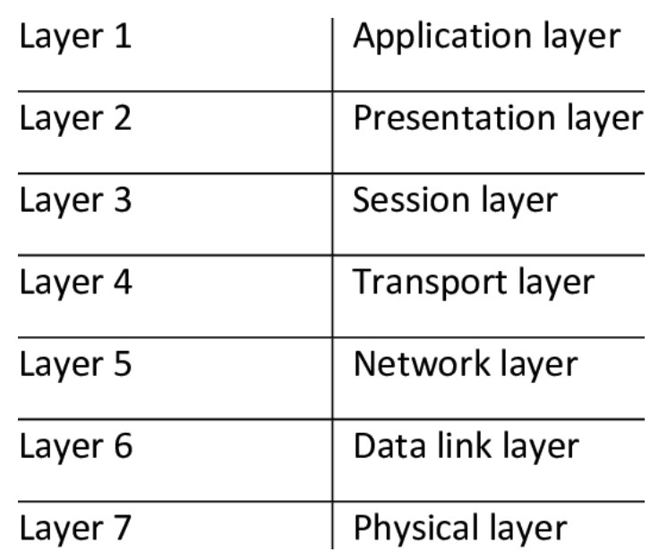
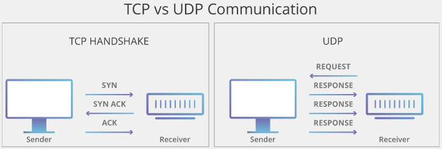
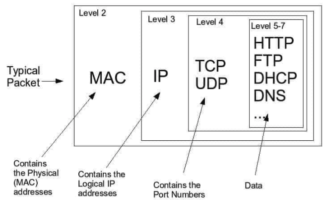
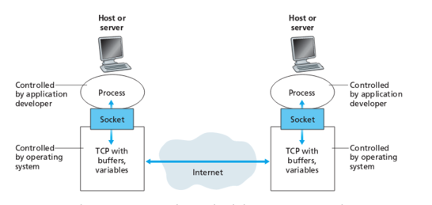

# [Socket.io](https://www.tutorialspoint.com/socket.io/)

_What is the benefit of transforming data into packets?_

- Packets are intended to transfer data reliably and efficiently instead of transferring a large file as a single block of data, sending smaller _packets_ of data helps ensure each section is transmitted successfully.

_UDP is often referred to as a connectionless protocol. Why is this?_

- UDP utilizes connectionless communication between programs in packets of data called datagrams.

_Can a socket server application have multiple socket connections?_

- On the server side, yes, there can be multiple connections as long as they are associated with different client-side IP/Port pairs.

_Can a socket connection application be connected to multiple socket servers?_

- No, all client side connections are associated with one single listening port.

_Can an application be both a socket server and a socket connection?_

- Technically, yes, as far as I understand. But client side connections should only be listening on one port. So there's that

### Vocab

- [_Web Socket_](https://en.wikipedia.org/wiki/WebSocket)
  - is a computer communications protocol, providing full-duplex commo channels over a single TCP connection.
- [OSI Model](https://www.cloudflare.com/learning/ddos/glossary/open-systems-interconnection-model-osi/)
  - Open Systems Interconnection model is a coneptual model created by the International Organization for Standardization which enables diverse communication systems to communicate using standard protocols. English - OSI provides a standard for different computer systems to be able to communicate with each other.
- [_TCP Model_](https://searchnetworking.techtarget.com/definition/TCP)
  - TCP is used in conjunction with IP (internet protocol) in order to maintain a connection between the sender and the target and to ensure packet order
- [_TCP_](https://searchnetworking.techtarget.com/definition/TCP)
  - Transmission Control Protocol is a standard that defines how to establish and maintain a network conversation through which application programs can exchange data. TCP is a connection-oriented protocol, which means a connection is established and maintained until the application programs at each end have finished exchanging messages
- [_Internet protocol (IP) suite_](https://en.wikipedia.org/wiki/Internet_protocol_suite)
  - is the coneptual model and set of communications protocols used in the internet and similar computer networks. It is commonly known as TCP/IP because the foundational protocols in the suite are the transmission control protocol (TCP) and the internet protocol(IP)
    
- [_UDP_](https://en.wikipedia.org/wiki/User_Datagram_Protocol)
  - The User Datagram Protocol is one of the core members of the internet protocol suite. With UDP, computer apps can send messages, in this case referred to as datagrams, to other hosts on an IP network. Prior communications are not required in order to set up communication channels or data paths.
    
- [_Packets_](https://techterms.com/definition/packet)
  - is a small amount of data sent over a network, such as LAN or the Internet. Similar to a real life package, each packet includes a source and destination as well as the content (or data) being transferred. When the packets reach their destination, they are reassembled into a single file or other contiguous block of data.
  - While the exact structure of a packet varies between protocols, a typical packet includes two sections — a **header and payload**.
  - Information about the packet is stored in the header.
  - The payload section of a packet contains the actual data being transferred.
    
- [_Socket_](https://techterms.com/definition/socket)
  - When a computer program needs to connect to a local or wide area network such as the internet, it uses a software component called a socket. The socket opens the network connection for the program, allowing data to be read and written over the network. It is important to note that these sockets are sofware, not hardware, like a wall socket.
    

### Resources

- [Socket.io vs Web Sockets](https://www.educba.com/websocket-vs-socket-io/)
- [sockiet.io Documentation](https://socket.io/docs/)
- [Socket.io Server API](https://socket.io/docs/server-api)
- [Socket.io Client API](https://socket.io/docs/client-api)
- [Socket Testing Tool](https://amritb.github.io/socketio-client-tool/)

#### Lecture

- Tab times
  6:42 - Brains, eyeballs, noses, arms
  6:50 - Socket.io (drawing.. kinda)
  7:02 - Rosie's a sad puppy
  7:04 - Code demo start
  7:11 - Q/A
  7:25 - Add in Events
  7:36 - John fires event
  7:49 - Break
  8:05 - Adding body parts
  8:19 - Socket lobby (namespace)
  8:33 - Health system (namespace sequel)
  9:00 - NGROK

[Table of Contents](../README.md)
