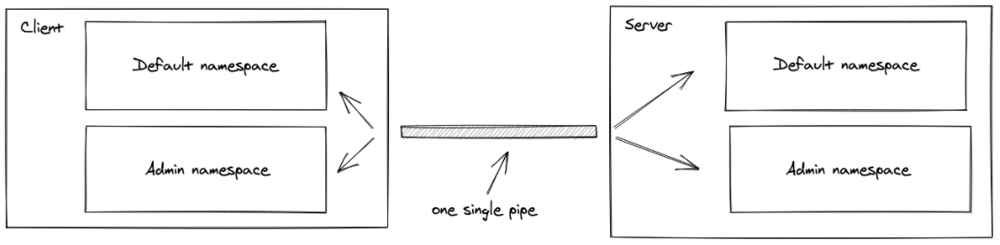

# Message Queues

1. What does it mean that web sockets are bidirectional? Why is this useful?

- Bidirectional just means communication two ways, like between a client side and a server side.

2. Does socket.io use HTTP? Why?

- Because it connects the server to the client using websockets through a port. If websocket is the protocol for communicating between server and client, HTTP is the protocol that references the client if a Websocket communication fails.

3. What happens when a client emits an event?

- It communicates the event to the server

4. What happens when a server emits an event?
5. What happens if a client “misses” an event?

- Connection will fail with

6. How can we mitigate this?

- Use an error event

#### Vocab

- [_Web Socket_](https://en.wikipedia.org/wiki/WebSocket)
  - is a computer communications protocol, providing full-duplex commo channels over a single TCP connection.
- [_Socket.io_](https://socket.io/docs/#:~:text=Socket.IO%20is%20a%20library,It%20consists%20of%3A&text=a%20Javascript%20client%20library%20for,be%20also%20run%20from%20Node.)
  - is a JavaScript library for realtime web applications. It enables realtime, bi-directional communication between web clients and servers. It has two parts: a client-side library that runs in the browser, and a server-side library for Node. js. Both components have a nearly identical API.
- [_Client_](https://socket.io/docs/client-api/)
- [_Server_](https://socket.io/docs/server-api/)
- [_Namespace_](https://socket.io/docs/namespaces/)
  - A Namespace is a communication channel that allows you to split the logic of your application over a single shared connection.
    
- [_Rooms_](https://socket.io/docs/rooms/)
  - Within each Namespace, you can define arbitrary channels called "rooms" that sockets can _join_ and _leave_. This is useful to _broadcast_ data to a subset of sockets.

#### Resources

- [Socket.io-client github](https://github.com/socketio/socket.io-client)
- [Socket.io Chat Example](https://socket.io/get-started/chat/)
- [Emit cheatsheet](https://socket.io/docs/emit-cheatsheet/)
