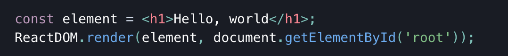
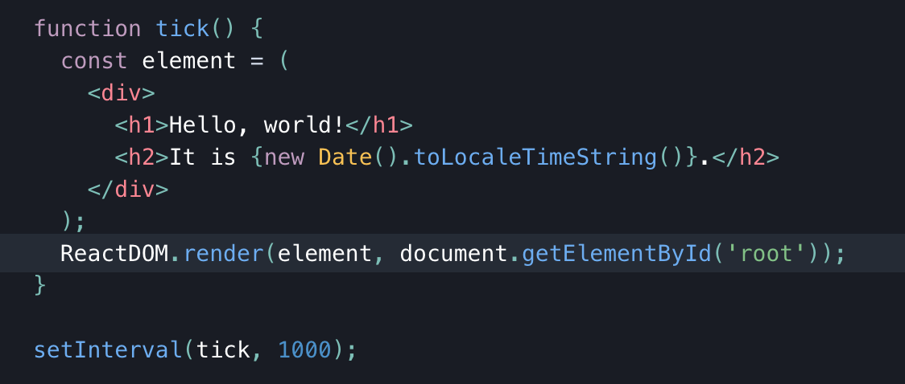
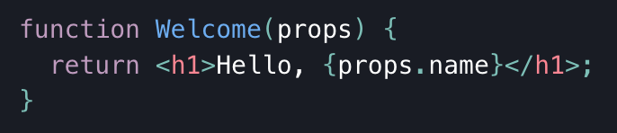
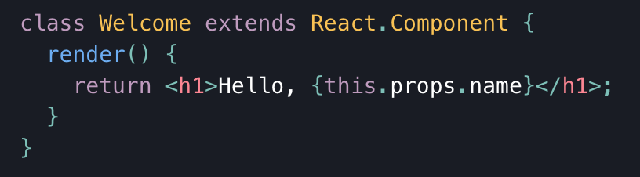

# [Component Based UI (React)](https://reactjs.org/)

1. Name 5 Javascript UI Frameworks (other than React)
   1. [Vue.js](https://vuejs.org/)
   2. [Ember](https://emberjs.com/)
   3. [Backbone.js](https://backbonejs.org/)
   4. [Angular](https://angularjs.org/)
   5. [Next.js](https://nextjs.org/)
2. [What’s the difference between a framework and a library?](https://blog.newrelic.com/engineering/best-javascript-libraries-frameworks/#:~:text=The%20key%20difference%20between%20JavaScript,than%20the%20other%20way%20around.)

- The key difference between JS libraries and frameworks is that libraries consist of functions that an application can call to perform a task, while a framework defines how a developer designs an application.
  - The framework calls on the application code, rather than the other way around
  - An example of a library for JS is jQuery
  - An example framework is React

### Vocab:

- [_JSX template_](https://reactjs.org/docs/introducing-jsx.html)
  - JSX stands for _JavaScript Extension_. It is a syntax extension to JS used with React to describe what the UI should look like. It is a template language that is able to use JavaScript.
  - Doesn't need to be used in seperate files like Mustache or EJS
- [_Rendering_](https://reactjs.org/docs/rendering-elements.html)

  - Not to be confused with **components**, rendering refers to the elements that you want to see on the screen
    - Unlike browser DOM elements, React elements are plain objects, and are cheap to create. React DOM takes care of updating the DOM to match the React elements
  - Rendering an Element:
    - An element you want to render you identify (in HTML) as the _root_ DOM node.
    - There can be many root DOM nodes
    - To render a React element into a root DOM node, pass both to **ReactDOM.render()**
      
      - Will render "Hello, world" on the page
  - Updating Rendered Element
    - React elements are immutable. Once created, you can't change its children or attributes.
    - Updating an element requires creating a new element, passing it to **ReactDOM.render()**
      

- [_Components and Props_](https://reactjs.org/docs/components-and-props.html)
  - _**Components**_ let you split the UI into independent, reusable pieces, and think about each piece in isolation. Conceptually, components are like JS functions that accept inputs called _props_ and return React elements describing what should appear on the screen.
    - Function Component:
      
    - Class Component:
      
  - _**Props**_
    - When React sees an element representing a user-defined component, it passes JSX attributes and children to this component as a single object called _props_
  - [_Detailed Component API reference_](https://reactjs.org/docs/react-component.html)
- [_State_](https://reactjs.org/docs/state-and-lifecycle.html)
  - State is similar to props but it is private and fully controlled by the component

#### Cheatsheets:

- [React](https://devhints.io/react)
- [Another React](https://reactcheatsheet.com/)
- [Sass](https://devhints.io/sass)

[Table of Contents](../README.md)
