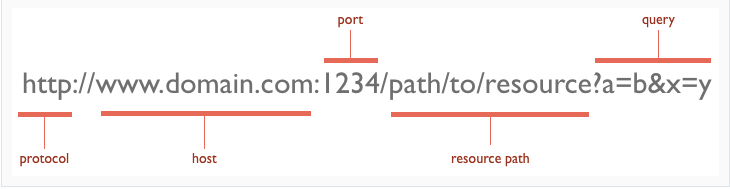

# [HTTP and REST](https://www.youtube.com/watch?v=Q-BpqyOT3a8)

## Video notes

What is an API? A contract provided from one piece of software to another.

What is Rest? Representational State Transfer

- Relies on stateless, client-server protocol, almost always HTTP
- Treats server objects as resources that can be created or destroyed
- Can be used by virtually any programming language

HTTP Methods

- GET: Retrieve data from a specified resource. This is the actual API call that we make to get the data through URI
- POST: Submit data to be processed to a specified resource
- PUT: Update a specified resource.
- DELETE: Delete a specified resource

Authentication

- Some API's require authentication to use their service, could be free or paid.
- use "curl"

## [http basics](https://code.tutsplus.com/tutorials/http-the-protocol-every-web-developer-must-know-part-1--net-31177)

**HTTP** - Hypertext transfer protocol allows for communiaction between a variety of hosts and clients, and supports a mxiture of network configs.

- Is a stateless protocol because it assumes very little about a particular system, and does not keep state between different message exchanges.
- Communication occurs between host and client via request/response pair. The client initiates an HTTP req message, which serviced through an HTTP res message in return.
- Current version of the protocol is HTTP/1.1 which have added features like _persistent connections_ and _fine-grained caching headers_.

**URLS** - Uniform Resource Locator's consistent of the following components:

- _protocol_ is typically http but can also be https for secure communications.
- _port_ default is 80 but can be set to whatever you want.
- _resource path_ is the local path to the resource on the server.
  

**URL Request verbs**

- _GET_ - fetch an existing resource. The URL contails all the necessary information the server needs to locate and return the resource.
- _POST_ - Create a new resource. POST req's usually carry a payload that specifies the data for the new resource.
- _PUT_ - update an existing resource. The payload may contain the updated data for the resource.
- _DELETE_ - delete an existing resource.

**Status Codes**
With URLs and verbs, the client can initiate requests to the server. In return, the server responds with status codes and message payloads.

- The status code is important and tells the client how to interpret the server response. The HTTP spec defines certain numbers and ranges for specific types of responses.
  **100: Informational Messages**
- All HTTP clients are required to accept the _transfer-encoding_ header.
- The server can send an _Expect: 100-continue_ message, telling the client to continue sending the remainder of the request, or ignore if it has already sent it.
  **200: Successful**
- Tells the client that the request was successfully processed. Most common being _200 OK_.
- For a GET request, the server sends the resource in the message body.
- _200_
- _201_ Will mainly use these two for the purposes of what we'll be doing in class.
  **300: Redirection**
  The most common use-case is to jump to a different URL in order to fetch the resource.
- _301 Moved Permanently_: the resource is now located a new URL
- _303 See other_
- _304 Not modified_
  **400: Client Error**
  Fire when the server thinks that the client is at fault, either by requesting an invalid resource or making a bad request.
- The most popular code in this class is _404 Not Found_, which indicates that the resource is invalid and does not exist on the server.
- _400 Bad Request_: malformed request.
- _401 Unauthorized_: request requires authentication. The client can repeat the request with the Authorization header. If client already included the header, the credentials were wrong.
- _403 Forbidden_: server has denied access to the resource.
  **500: Server Error**
  This class are used to indicate a server failure while processing the request.
- The most common code is _500 Internal Server Error_
- _501 Not Implemented_: server doesn't support the requested functionality
- _503 Service Unavailable_: could happen if internal system on the server side failed or is overloaded.

[What is ReST](https://restfulapi.net/)

REST is an acronym for Representational State Transfer.

**Guiding Principles of REST**

1. _Client-server_ - user interface concerns from data storage are improved.
2. _Stateless_ - Each request from client to server must contain all of theinformation necessary to understand the request, and cannot take advantage of any stored context on the server. Session state is therefore kept entirely on the client.
3. _Cacheable_ – Cache constraints require that the data within a response to a request be implicitly or explicitly labeled as cacheable or non-cacheable. If a response is cacheable, then a client cache is given the right to reuse that response data for later, equivalent requests.
4. _Uniform interface_ – By applying the software engineering principle of generality to the component interface, the overall system architecture is simplified and the visibility of interactions is improved. In order to obtain a uniform interface, multiple architectural constraints are needed to guide the behavior of components. REST is defined by four interface constraints: identification of resources; manipulation of resources through representations; self-descriptive messages; and, hypermedia as the engine of application state.
5. _Layered system_ – The layered system style allows an architecture to be composed of hierarchical layers by constraining component behavior such that each component cannot “see” beyond the immediate layer with which they are interacting.
6. _Code on demand (optional)_ – REST allows client functionality to be extended by downloading and executing code in the form of applets or scripts. This simplifies clients by reducing the number of features required to be pre-implemented.

**Resource**
The key abstraction information in REST is a resource.

- Any information that can be named can be a resource
- REST uses a resource identifier to identify the particular resource involved in an interaction between components.
  **Resource Methods**
  Although a large number of people wrongly relate resource methods to HTTP _GET/PUT/POST/DELETE_ methods, you can still use them interchangeably.

**REST and HTTP are not the same**
Data and functionality are considered resources and are accessed using Uniform Resource Identifiers (URIs). The resources are acted upon by using a set of simple, well-defined operations. The clients and servers exchange representations of resources by using a standardized interface and protocol. Typically HTTP.

1. Which 3 things had you heard about previously and now have better clarity on?

   - I thought it was interesting how resource methods weren't really intended to be interchangeable but are used that way.
   - I learned more about HTTP, or maybe got more clarity on what it does.
   - I learned more about what status codes meant and use cases for them.

2. Which 3 things are you hoping to learn more about in the upcoming lecture/demo?
   - I'm hoping to learn about the use cases for NoSQL vs SQL since last time I used API's I learned how to store data in a SQL database.
   - A little more clarity on stateless protocols and the disctintions between HTTP and REST
   -
3. What are you most excited about trying to implement or see how it works?
   - I'm eager to see what CRUD methods look like when calling an API. I'm thinking that it'll look a long like the MONGODB_URI one we just used for notesy and that not much else will be different but comparatively to SQL; I'm excited to see how NoSQL works with this project.

[Swagger docs](https://swagger.io/docs/)
[Swagger editor](https://editor.swagger.io/)
[http reference](https://code-maze.com/the-http-reference/)
[rest reference](https://www.restapitutorial.com/lessons/httpmethods.html)

[Table of Contents](../README.md)
