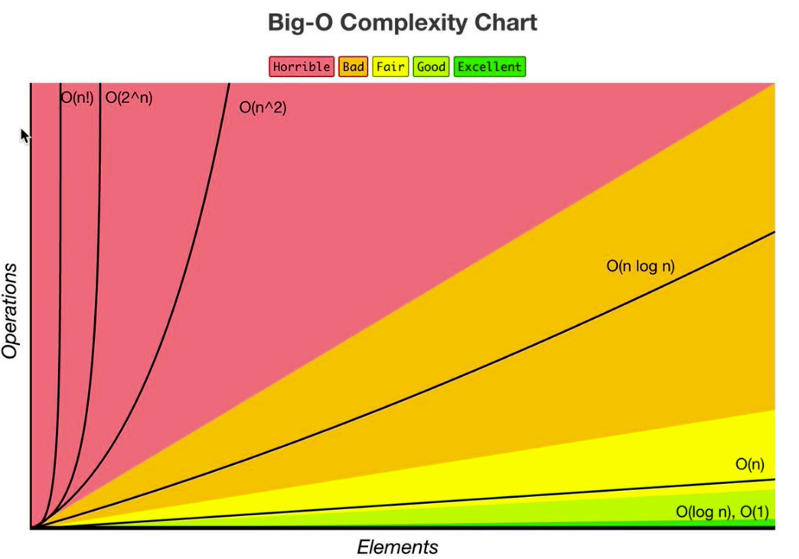

# What is good code?

**_Good code is:_**

1. Readable
2. Scalable

Big O notation is the language we use for talking about how long an algorithm takes to run.
We can run 2 functions next to eachother and find out which one runs faster.

When we talk about Big O and scalability of code, we mean when we grow bigger and bigger with our input, how much does the algorithm or function slow down?
How many steps does a function take to run?
Algorithmic effeciency

[Table of Contents](../README.md)
