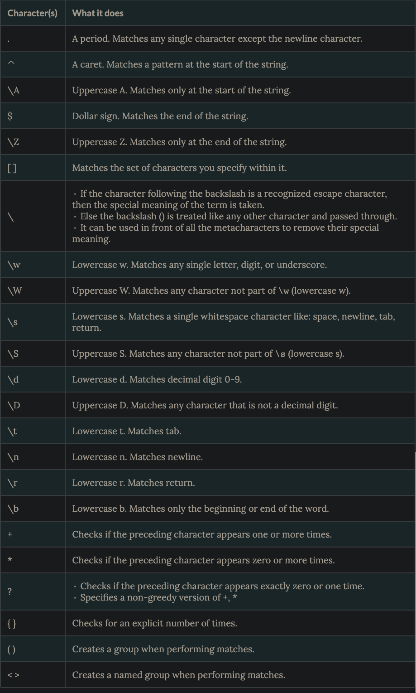

# Automation

## [Python Regex Tutorial](https://www.datacamp.com/community/tutorials/python-regular-expression-tutorial)

In Python, regex supported by `re` module which provides several functions that make it a skill worth mastering.

- [Click here](./j-notebooks/automation.ipynb) to see my Jupyter notebook on code samples with notes

[shutil - High level file operations](https://pymotw.com/3/shutil/)

### Videos
- [Automation ideas](https://www.youtube.com/watch?v=qbW6FRbaSl0&t=69s)
- [Automating your browser and Desktop apps](https://www.youtube.com/watch?v=dZLyfbSQPXI)

### Resources
- [Watchdog docs](https://pythonhosted.org/watchdog/)

[Table of Contents](../README.md)
