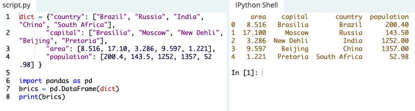
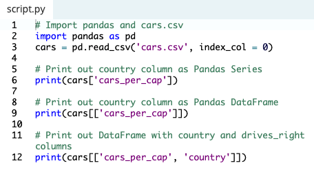

## [Numpy Arrays](https://www.learnpython.org/en/Numpy_Arrays)

Numpy arrays are great alternatives to python lists
- key advantages are they are fast, easy to work with, and give users the opportunity to perform calculations across entire arrays
- another great feature is the ability to **subset**

## [Pandads Basics](https://www.learnpython.org/en/Pandas_Basics)

Pandas is a high-level data manipulation tool built on the numpy package and its key data structure is called the **DataFrame**
- DataFrames allow you to store and manipulate tabular data in rows of observations and columns of variables
- there are many ways to create DataFrames, one way being to use a dictionary:

- with the **brics** dataframe, Pandas has assigned a key for each country as the numerical values 0 through 4
- another way to create a dataframe is by importing a csv file using Pandas.
- there are several ways to index a pandas dataframe. 
- one of the easiest  ways to index is to use square bracket notation:

[Table of Contents](../README.md)

