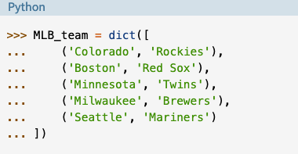

# [Dictionaries in Python](https://realpython.com/python-dicts/)

A dictionary is a composite data type which is similar to a list in that it is a collection of objects.

Dictionaries and lists share:
- Both are mutable
- are dynamic. They can grow and shrink as needed
- Both can be nested. A list can contain another list. A dictionary can contain another dictionary
- A dictionary can contain a list and vise versa

Dictionaries differ from lists:
- List elements are accessed by their position in the list, via indexing
- Dictionary elements are accessed via keys

A dictionary consists of a collection of key-value pairs. Each key value pair maps the key to its associated value
- you can define a dictionary by enclosing the key value pairs in curly brackets ```(my_dict = { key: value, key: value })``` or,
- you can construct a dictionary using the built-in dict() function. 
- The argument to dict() should be a sequence of key-value pairs. 
- A list of tuples works well for that:
  
- Dictionaries are **not** accessed by numerical index

### Dictionary Access
A value is retrieved from a dictionary by specifying its corresponding key in square brackets


[Table of Contents](../README.md)
