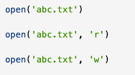

# FileIO & Exceptions

- [Read & Write Files in Python](https://realpython.com/read-write-files-python/)


What is a file? 
  - A file is a contiguous set of bytes used to store data
  - These byte files are translated into binary (1's and 0's) for processing
Files are composed of three main parts:
  1. **Header:** metadata about the contents of the file (file name, size, type, etc)
  2. **Data:** contents of the file as written by the creator or editor
  3. **End of file (EOF):** special character that indicates the end of the file

What the data in a file contains is represented by an extension, which is the characters after the dot of a file. like this file is **.md** to specify that the contents of this file contain markdown. 

### File Paths
To access a file, its path is required, which is a string that represents the location of the file where it's being stored. It's broken up into three major parts:
1. **Folder Path:** the file folder location on the file system where subsequent folders are separated by a forward slash / (Unix) or backslash \ (Windows)
2. **File Name:** the actual name of the file
3. **Extension:** the end of the file path pre-pended with a period(.) used to indicate the file type

### Line Endings
One problem encountered when working with file data is the representation of a new line or line ending.
- Line endings should use the sequence of the **Carriage Return (CR or \r)** _and_ the **Line Feed (LF or \n)** characters
- Windows uses the (CR+LF or \r\n) to indicate a new line
  - Example:


- Unix and Mac  versions use the LF character only. Taking the same .txt example from above, would look like this:

- Situations like this need to be accounted for when writing a file

## Opening and Closing a File in Python
To open a file you need to invoke the ```open()``` built-in function for Python.
- open() has a single required argument that is the path to the file.open()
- has a single return, the **file object**
- **You should always make sure that an open file is properly closed**
- It's important to remember that closing the file is your responsibility. 
- The Pythonic best practice is to make sure that your code behaves in a way that is well defined and reduces any unwanted behavior (that a file not closed properly would result in)

There are two ways that you can ensure that a file is closed properly, **even when encountering an error**.
- **try-finally:**
```
reader = open('dog_breeds.txt')
try:
    # Further file processing goes here
finally:
    reader.close()
```
- **with** statement:
```
with open('dog_breeds.txt') as reader:
    # Further file processing goes here
```
- The with statement automatically takes care of closing the file once it leaves the **with** block, even when an error is raised. 
- **with** statement is the preferred method as it allows for cleaner code and makes handling any unexpected errors easier.
  - You'll likely want to use the second argument, **mode**
  - This argument is a string that contains multiple characters to represent how you want to open the file.
  - The default and most common is 'r', which represents opening the file in read-only mode as a text file
``` 
with open('dog_breeds.txt', 'r') as reader:
    # Further file processing goes here
```
- The most common modes are:

- Other options can be found **[here](https://docs.python.org/3/library/functions.html#open)**

There are three different categories of file objects:
- Text files
- Buffered binary files
- Raw binary files
Each of which are defined in the ```io``` module. 

### Text File Types
Some examples of how to open .txt files:

These types will return a TextIOWrapper file object:

More file types:
- **Buffered binary** file types
  - use ```'rb'```(read binary) or ```'wb'```(write binary) as your open() argument  
- **Raw File** isn't typically used

- [Read & Write Quiz](https://realpython.com/quizzes/read-write-files-python/)

- [Exceptions in Python](https://realpython.com/python-exceptions/)
- [Video on Exceptions](https://realpython.com/courses/reading-and-writing-files-python/)

[Table of Contents](../README.md)
