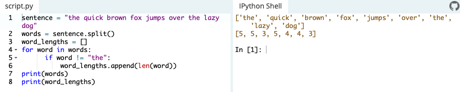

# Advanced Tutorials

## [Generators](https://www.learnpython.org/en/Generators)

Generators are used to create iterators
- are simple functions which return an iterable set of items, one at a time, in a special way
- when an iteration over a set of items start using the for statement, the generator is run
- once the generators function code reaches a **yield** statement, the generator yields its execution back to the for loop, returning a new value from the set
- the generator function can generate as many values as it wants, yielding each one in its turn

## [List Comprehensions](https://www.learnpython.org/en/List_Comprehensions)

List comprehensions are a very power tool which creates a new list based on another list in a single, readable line. Example:

## [Multiple Function Arguments](https://www.learnpython.org/en/Multiple_Function_Arguments)

Every function in python receives a predefined number of arguments
- you can use the **therest** variable which is a list of variables, which receives all arguments which were given 

## [Regular Expressions](https://www.learnpython.org/en/Regular_Expressions)

Regex is a tool for matching patterns in text.
- In Python, we have the re module
- The applications for regex are wide-spread, but they are fairly complex. 
- A complete reference for the re syntax is available [here](https://docs.python.org/3/library/re.html#regular-expression-syntax%22RE%20syntax)

## [Exception Handling](https://www.learnpython.org/en/Exception_Handling)

Pythons solution to erros are **exceptions**. If you don't want an exception to stop the entire program, use a **try/except** block.
- They act like a try/catch block in an async function in JavaScript, pretty straightforward.
- Refer to [Python Docs](https://docs.python.org/3/tutorial/errors.html#handling-exceptions) for more

## [Sets](https://www.learnpython.org/en/Sets)

Sets are lists with no duplicate entries
- they're a useful tool in python since they have the ability to calculate differences and intersections between other sets.
- methods for sets include, **intersection**, **symmetric_difference**, **difference**, **union** 

## [Serialization](https://www.learnpython.org/en/Serialization)

Python provides built-in JSON libraries to encode and decode JSON through the **json** ([python docs](https://docs.python.org/3/library/json.html)) module.
- There are two basic formats of JSON data:
  - string format, which is mainly used to pass the data into another program or load into a datastructure. Or,
  - object datastructure, in python, consists of lists and dictionaries nested inside each other. The object datastructure allows one to use python methods (for lists and dictionaries) to add, list, search and remove elements from the datastructure
- The load JSON back to a data structure, use the **loads** method. This method takes a string and turns it back into the json object
- To encode a data structure to JSON, use the **dumps** method which takes an object and returns a string
- you can also use a proprietary method called **pickle** which does the same thing as **dumps**

## [Partial functions](https://www.learnpython.org/en/Partial_functions)

You can create partial functions from the **[functools library](https://docs.python.org/3/library/functools.html)**
- Partial functions allow one to derive a function with x parameters to a function with fewer params and fixed values set for the more limited function

## [Code Introspection](https://www.learnpython.org/en/Code_Introspection)

is the ability to examine classes, functions and keywords to know what they are, what they do, and what they know.
- See [python docs](https://docs.python.org/3/library/inspect.html) for more on the **inspect** module that gives a list of attributes for this
- Some functions and utilites include:
  - help()
  - dir() 
  - hasattr() 
  - id() 
  - type() 
  - repr() 
  - callable() 
  - issubclass() 
  - isinstance() 
  - __doc__ 
  - __name__
- Arguably the most important one being the **help()** function since you can use it to find what other functions do

## [Closures](https://www.learnpython.org/en/Closures)

A closure function is an object that remembers values in enclosing scopes even if they are not present in memory. 
- A **nested function** is defined inside another function
- It's **very important** to note that the nested functions can access the variables of the enclosing scope (as read only).
- You can use the **nonlocal** keyword explicitly with these variables in order to modify them

## [Decorators](https://www.learnpython.org/en/Decorators)

Allow you to make simle modifications to callable objects like functions, methods, or classes

## [Map, Filter, Reduce](https://www.learnpython.org/en/Map,_Filter,_Reduce)

are paradigms of functional programming.
- These 3 functions allow you to apply a function across a number of iterables, in one swoop. 
- **map** and **filter** come built-in with python (__builtins__ module) and require no importing.
- **reduce** needs to be imported as it resides in the functools module.
### Map
- syntax: map(func, *iterables)
- func is the function on which each element in iterables would be applied on
- the asterisk next to iterables means there can be as many iterables as possible
- **Important to note:**
    1. In Python 2, the map() function retuns a list. In Python 3, however, the function returns a map object which is a generator object. To get the result as a list, the built-in list() function can be called on the map object. i.e. list(map(func, *iterables))
    2. The number of arguments to func must be the number of iterables listed.
### Filter
While Map passes each element in the iterable through a function and returns the result of all elements having passed through the function, filter(), requires the function to return boolean values and then passes each element in the iterable through the function, _filtering_ away false values. 
- syntax: filter(func, iterable)
- **Important to note:**
    1. Unlike map(), only one iterable is required.
    2. The func argument is required to return a boolean type. If it doesn't, filter simply returns the iterable passed to it. Also, as only one iterable is required, it's implicit that func must only take one argument.
    3. filter passes each element in the iterable through func and returns **only** the ones that evaluate to true.
### Reduce
applies a function of two arguments to the elements of an iterable, optionally starting with an itial argument
- syntax: reduce(func, iterable[, initial])
- **Important to note:**
    1. func requires two arguments, the first of which is the first element in iterable (if initial is not supplied) and the second the second element in iterable. If initial is supplied, then it becomes the first argument to func and the first element in iterable becomes the second element
    2. reduce "reduces" (I know, forgive me) iterable into a single value.

[Table of Contents](../README.md)
