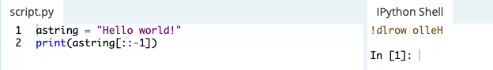

## [Hello, World!](https://www.learnpython.org/en/Hello%2C_World%21)

Python encourages programmers to program without boilerplate (prepared) code.
- The simplest directive in Python is the "print" directive - it simply prints out a line and also includes a new line, unlike C.
- There are two major Python versions, Python 2 and 3, which are quite different
- v3 is more semantically correct and supports newer features ie, v3 the **print** statement is a function so must include parantheses whereas v2 it's invoked without them.
- It operates a lot like the console.log() in JavaScript 
- Comments in your code are used with the # symbol

Python uses indentation for blocks, rather than curly braces. 
- Both tabs and spaces are supported, but the standard indentation requires standard py code to use four spaces.

## [Variables and Types](https://www.learnpython.org/en/Variables_and_Types)

Python is completely object oriented, not "statically typed".
- You do not need to declare variables before using them, or declare their type
- **Every variable in py is an object**
- **Numbers**
  - Python supports two types numbers; integers and floating point numbers (also complex numbers)
  - The floating point number represents the **float** type object.
    - Float is used to represent real numbers and is written with a decimal point dividing the integer and fractional parts
    - **[Example:](https://docs.python.org/3/tutorial/floatingpoint.html)** 97.98, 32.3+e18, -32.54e100 all are floating point numbers
- **Strings**
  - Strings are defined either with single or double quotes
  - The difference is that using double quotes makes it easy to include apostrophes whereas these would terminate the string using single quotes.
  - 'That\'s nice!' <- Cause JavaScript  
  - There are additional variations defining strings that make it easier to include things such as carriage returns, backslashes, and Unicode characters that are explained **[here](https://docs.python.org/3/tutorial/introduction.html#strings)**

## [Lists](https://www.learnpython.org/en/Lists)

Lists are very similar to arrays. They can contain any type of variable, and they can contain as many variables as you wish.
- Lists can also be iterated over in a very simple manner, like so:


## [Basic Operators](https://www.learnpython.org/en/Basic_Operators)

**Arithmetic Operators**
- Just as any programming language, addition +, subraction -, multiplication *, and division / operators can be used with numbers.
- Modulo (%) is also available, which returns the integer remainder of the division. Not to be confused with the division operator (/).
- / divides, % returns remainder
- Two multiplication symbols ```(**)``` makes a **power relationship** 
- Python supports concatenating strings using the addition (+) operator 
- Notice in the image above how I needed to give additional quotes with a space in the middle to account for that space printing. Running that concatenation like JavaScript eliminates the space.
- You can also multiply strings 
- Lists can be joined with addition operators: 
- Python supports forming new lists with a repeating sequence like strings above: 

## [String Formatting](https://www.learnpython.org/en/String_Formatting)

Python uses C-style string formatting to create new, formatted strings. 
- The "%" operator is used to format a set of variables enclosed in a **tuple** (a fixed size list), together with a format string, which contains normal text together with **argument specifiers**, special symbols like **%s** and **%d**. 
- To use two or more argument specifiers, use a tuple(parantheses) 

**Basic Argument Specifiers**
- %s - String (or any object with a string representation, like numbers)
- %d - Integers
- %f - Floating point numbers
- %.<number of digits>f - Floating point numbers with a fixed amount of digits to the right of the dot.
- %x/%X - Integers in hex representation (lowercase/uppercase)

## [Basic String Operations](https://www.learnpython.org/en/Basic_String_Operations)

You can print out the length of a strength using the **len** object like print(len(astring)). If I assign the value of a sentence the len object would give me the amount of characters in that sentence 
- You can also find where an index is:  it prints 4 because the location of the first occurence of "o" is 4 characters away from the first character.
- This example only recognizes the first occurrence
- The **.count** method counts however many of the character you give it in the string: 
- You can reverse a string like this: 
- toUpperCase and toLowerCase 

## [Conditions](https://www.learnpython.org/en/Conditions)

Python uses boolean variables to evaluate conditions. True and False are returned when an expression is compared or evaluated.
- Variable assignment is done using a single equals operator **=** whereas comparison between two variables is done using the double equals operator **==**
- Not equals operator is marked with **!=**
- The **and/or** boolean operators allow building complex boolean expressions 
- Python if statement using code blocks. This doesn't work without indentation: 
- A statement evaluates to true if onen of the following is correct:
    1. The "True" boolean variable is given, or calculated using an expression, such as arithmetic comparison
    2. An object which is not considered "empty" is passed
- Unlike the **==** operator, the **is** operator does not match the values of the variables, but the instances themselves. 
- Using **not** before a boolean expression inverts it 

## [Loops](https://www.learnpython.org/en/Loops)

There are two types of loops in Python, **for** and **while**.

### **for** loops
For loops can iterate over a sequence of numbers using the **[range](https://www.w3schools.com/python/gloss_python_for_range.asp)** and **[Xrange](https://www.educative.io/edpresso/what-does-xrange-function-do-in-python)** functions. 
- Range returns a new list with numbers of that specified range, whereas
- Xrange returns an iterator, which is more efficient

### **while** loops
- repeat as long as a certain boolean condition is met.
- **break** is used to exit a for loop or a while loop, whereas **continue** is used to skip the current block, and return to the for or while statement

- Python uses **else** clauses for loops. When the loop condition of **for** or **while** statement fails then code part in **else** is executed. 
- If **break** statement is executed inside for loop then the **else** part is skipped. Note that **else** part is executed even if there is a **continue** statement

## [Functions](https://www.learnpython.org/en/Functions)

Functions are a convenient way to divide your code into useful blocks, allowing us to order our code, make it more readable,reuse it and save some time.
- Functions are a key way to define interfaces so programmers can share their code
- Functions in python are defined using the block keyword **def**, followed with the function's name as the block's name. 
- Invoking a function: 


## [Classes and Objects](https://www.learnpython.org/en/Classes_and_Objects)

Objects are an encapsulation of variables and functions into a single entity. 
- Objects get their variables and functions from classes. 
- Classes are essentially a template to create your objects.

## [Dictionaries](https://www.learnpython.org/en/Dictionaries)

A dictionary is a data type similar to arrays, but works with keys and values instead of indexes. 
- Each value stored in a dictionary can be accessed using a key, which is any type of object(string, num, list, etc) instead of using its index to address it. 


- Dictionaries can be iterated over, just like a list. However, a dictionary doesn't keep the order of the values stored in it. 
- To iterate over key value pairs, use this syntax:

- To remove an index:


## [Modules and Packages](https://www.learnpython.org/en/Modules_and_Packages)

A module is a piece of software that has specific functionality like building a ping pong game, one module would be responsible for the game logic, and another module would be responsible for drawing the game on the screen.
- each module is a different file, which can be edited separately.
- modules in python are files with a .py extension (module_name.py)
- modules are imported using the **import** command
- if a .pyc file exists, it gets loaded instead of the .py file
- you can import specific functions from a file using the **from** command (**from** module_name **import** this_function)
- the first time a module is loaded into a py script, it is initialized by executing the code in the module once
- if another module in your code imports the same module again, it will not be loaded twice but once only so local variables inside the module act as a singleton
- Check out [Python Standard Library](https://docs.python.org/3/library/) for a list of built in modules
- 2 very important functions come in handy when exploring modules in Python: **dir** and **help** functions
- **dir** looks for which functions are implemented in each module (import urllib >>> dir(urllib))
- **help** is used after we've found a directory that we want to read (help(urllib.urlopen))
- Packages are namespaces which contain multiple packages and modules themselves.
- Each package in python is a directory which **must** a special file called **`__init__.py`**
- the init file can also decide which modules the package exports as the API, while keeping other modules internal, by overriding the **`__all__`** variable

[Table of Contents](../README.md)
