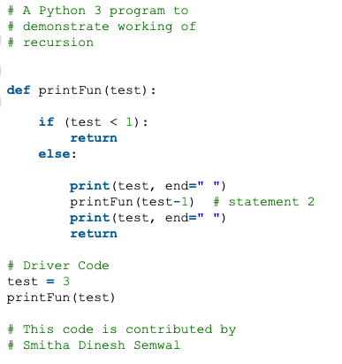

# Testing and Modules

## [In Tests We Trust - TDD with Python](https://code.likeagirl.io/in-tests-we-trust-tdd-with-python-af69f47e6932)

In TDD, your entire approach to writing a program will be in baby steps, making each test you write, making it pass, and then refactoring from there for better efficiency.
- The greatest advantage of TDD is to craft the **software design first**
- Your code will be more reliable: after a change you can run your tests
### Vocab
- Unit tests
  - are some pieces of code to exercise the input, output, and behavior of your code. 
- TDD
  - Test driven development is a strategy to think and write using tests first
- AAA
  - **Arrange:**
    - Organize the data needed to execute that piece of code(input)
  - **Act:**
    - execute the code being tested (exercise the behavior)
  - **Assert:**
    - after code execution, check if the result (output) is the same as you were expecting
- The Cycle
  - is made up by three steps:
    - Write a unit test and make it fail. It needs to fail because the feature hasn't been written yet and you need to verify it fails
    - Write the feature and make the test pass
    - Refactor the code


## [Recursion](https://www.geeksforgeeks.org/recursion/)
**How is a particular problem solved using recursion?**
- The idea is to represent a problem in terms of one or more smaller problems, and add one or more base conditions that stop the recursion
**What is the difference between direct and indirect recursion?**
- A function is called direct recursive if it calls the same function
- A function is indirect recursive if it calls another function and that second function calls the first function directly or indirectly 
**How is memory allocated to different function calls in recursion?**
- When any function is called from main(), the memory is allocated to it on the stack. 
- A recursive function calls itself, the memory for a called function is allocated on top of memory allocated to calling function and different copy of local variables is created for each function call.
- When the base case is reached, the function returns its value to the fucntion by whom it is called and memory is de-allocated and the process continues
  - Example:
    


### Vocab
- Recursion
  - The process in which a function calls itself directly or indirectly 
- Base condition
  - is the starting point of your condition. If you're looking to solve a problem where n is less than or equal to one, that is your base case
    - ```if(n <= 1)```


### Videos
- [Intro to Modules and Packages](https://realpython.com/courses/python-modules-packages/)

### Bookmark/Skim
[Google for Education: Python Lists](https://developers.google.com/edu/python/lists)
[Google for Education: Python Strings](https://developers.google.com/edu/python/strings)
[Python Modules and Packages](https://realpython.com/python-modules-packages/)
[Pytest Documentation](https://docs.pytest.org/en/latest/)
[PyTest Tutorial](https://www.guru99.com/pytest-tutorial.html)

[Table of Contents](../README.md)
